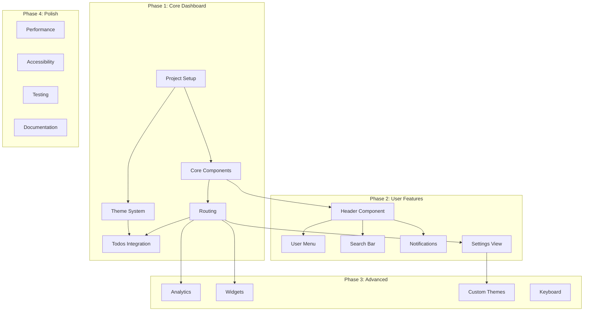

# Dashboard Implementation Workflow

## Executive Summary
Systematic implementation workflow for building a Lit 3 dashboard with parallel execution strategies, dependency mapping, and quality gates across 4 phases.

## Workflow Metadata
- **Strategy**: Systematic with parallel execution
- **Timeline**: 4 weeks (20 working days)
- **Team Size**: 1-3 developers (scales with parallel execution)
- **Complexity**: High (multiple integrations, responsive design, theming)

## Dependency Graph Overview


---

## PHASE 1: Core Dashboard Foundation (Days 1-5)

### Day 1: Project Setup & Infrastructure
**⚡ PARALLEL EXECUTION GROUP 1A**

#### Task 1.1: Development Environment Setup
```yaml
id: setup_environment
duration: 2h
parallel: true
dependencies: []
subtasks:
  - Install @vaadin/router: npm install @vaadin/router
  - Install lit dependencies: npm install lit @lit/context
  - Configure Vite for dashboard: Update vite.config.js
  - Setup directory structure: Create src/dashboard/ hierarchy
  - Initialize git branch: git checkout -b feature/dashboard
validation:
  - npm run dev starts without errors
  - All dependencies installed
  - Directory structure created
```

#### Task 1.2: Base Styles & Theme Tokens
```yaml
id: setup_styles
duration: 3h
parallel: true
dependencies: []
subtasks:
  - Create styles/themes/light-theme.js
  - Create styles/themes/dark-theme.js
  - Create styles/shared-styles.js
  - Create styles/responsive.js
  - Define CSS custom properties
  - Setup breakpoint system
validation:
  - All theme tokens defined
  - CSS variables accessible
  - Responsive utilities working
```

#### Task 1.3: Service Layer Foundation
```yaml
id: setup_services
duration: 2h
parallel: true
dependencies: []
subtasks:
  - Create services/storage-service.js
  - Create services/theme-service.js
  - Create utils/constants.js
  - Create utils/helpers.js
  - Implement localStorage abstraction
validation:
  - Services instantiate correctly
  - localStorage operations work
  - Theme detection functional
```

### Day 2-3: Core Dashboard Components

#### Task 1.4: Main Dashboard Container
```yaml
id: dashboard_container
duration: 4h
parallel: false
dependencies: [setup_environment, setup_styles]
subtasks:
  - Create app-dashboard.js component
  - Implement responsive layout structure
  - Setup Lit Context providers
  - Add theme context integration
  - Implement sidebar toggle logic
  - Add route outlet placeholder
validation:
  - Dashboard renders at localhost:5173
  - Layout structure visible
  - Context providers working
```

**⚡ PARALLEL EXECUTION GROUP 1B**

#### Task 1.5: Sidebar Component
```yaml
id: sidebar_component
duration: 5h
parallel: true
dependencies: [dashboard_container]
subtasks:
  - Create components/app-sidebar.js
  - Implement navigation items array
  - Add responsive behavior (overlay/fixed)
  - Style active states
  - Add hamburger menu trigger
  - Implement backdrop for mobile
validation:
  - Sidebar renders with items
  - Responsive modes work
  - Active state highlighting
  - Mobile overlay functional
```

#### Task 1.6: Theme Service Implementation
```yaml
id: theme_service_impl
duration: 4h
parallel: true
dependencies: [setup_services, setup_styles]
subtasks:
  - Complete theme-service.js implementation
  - Add theme detection logic (URL > localStorage > system)
  - Implement applyTheme method
  - Add theme persistence
  - Create theme switcher component
  - Add real-time theme updates
validation:
  - Theme switching works
  - Persistence across reloads
  - URL parameter updates
  - System preference detection
```

### Day 4: Routing System

#### Task 1.7: Router Service & Configuration
```yaml
id: router_setup
duration: 4h
parallel: false
dependencies: [dashboard_container]
subtasks:
  - Create services/router-service.js
  - Configure Vaadin router
  - Setup route definitions
  - Implement lazy loading
  - Add route guards/middleware
  - Create not-found view
validation:
  - Routes navigate correctly
  - Lazy loading works
  - 404 page displays
  - URL updates on navigation
```

### Day 5: Todos Integration

#### Task 1.8: Todos View with Tabs
```yaml
id: todos_view
duration: 5h
parallel: false
dependencies: [router_setup]
subtasks:
  - Create views/todos-view.js
  - Implement tab component structure
  - Integrate all 4 todo variants
  - Add tab switching logic
  - Style tab interface
  - Handle component mounting/unmounting
validation:
  - All todo variants display
  - Tab switching works
  - Existing todo functionality preserved
  - Proper component lifecycle
```

**🔍 PHASE 1 QUALITY GATES**
```yaml
validation_checklist:
  - [ ] Dashboard loads at root URL
  - [ ] Sidebar navigation functional
  - [ ] Theme switching works (light/dark)
  - [ ] Responsive behavior correct
  - [ ] All todo components integrated
  - [ ] Routing works for all defined paths
  - [ ] No console errors
  - [ ] Performance: < 3s initial load
```

---

## PHASE 2: User Features (Days 6-10)

### Day 6: Header & User Components

**⚡ PARALLEL EXECUTION GROUP 2A**

#### Task 2.1: Header Component
```yaml
id: header_component
duration: 3h
parallel: true
dependencies: [dashboard_container]
subtasks:
  - Create components/app-header.js
  - Add logo/branding area
  - Integrate theme switcher
  - Add responsive behavior
  - Style with theme tokens
validation:
  - Header renders correctly
  - Theme switcher integrated
  - Responsive layout works
```

#### Task 2.2: User Menu Component
```yaml
id: user_menu
duration: 4h
parallel: true
dependencies: [header_component]
subtasks:
  - Create components/app-user-menu.js
  - Implement dropdown menu
  - Add user avatar display
  - Create menu items (profile, settings, logout)
  - Add click-outside detection
  - Style dropdown with animations
validation:
  - User menu displays
  - Dropdown toggles correctly
  - Click outside closes menu
  - Navigation links work
```

### Day 7-8: Search & Notifications

**⚡ PARALLEL EXECUTION GROUP 2B**

#### Task 2.3: Search Bar Implementation
```yaml
id: search_bar
duration: 6h
parallel: true
dependencies: [header_component]
subtasks:
  - Create components/app-search-bar.js
  - Implement search input with icons
  - Add debounced search logic
  - Create search results dropdown
  - Add keyboard shortcuts (Cmd/Ctrl+K)
  - Implement search history
  - Add quick actions support
validation:
  - Search input functional
  - Keyboard shortcut works
  - Results display correctly
  - Search history persists
```

#### Task 2.4: Notifications System
```yaml
id: notifications
duration: 6h
parallel: true
dependencies: [header_component]
subtasks:
  - Create components/app-notifications.js
  - Create services/notification-service.js
  - Implement notification dropdown
  - Add notification categories
  - Create unread counter badge
  - Add mark as read functionality
  - Implement notification persistence
validation:
  - Notifications display
  - Badge counter updates
  - Mark as read works
  - Categories filter correctly
```

### Day 9: Settings View

#### Task 2.5: Settings View Implementation
```yaml
id: settings_view
duration: 5h
parallel: false
dependencies: [router_setup, theme_service_impl]
subtasks:
  - Create views/settings-view.js
  - Add theme preferences section
  - Create display options
  - Add data management section
  - Implement form validation
  - Add save/reset functionality
validation:
  - Settings view loads
  - Forms validate correctly
  - Preferences save/persist
  - Theme changes apply
```

### Day 10: Profile View

#### Task 2.6: Profile View Implementation
```yaml
id: profile_view
duration: 5h
parallel: false
dependencies: [router_setup, user_menu]
subtasks:
  - Create views/profile-view.js
  - Add avatar upload interface
  - Create profile form fields
  - Add password change section
  - Implement form validation
  - Add save functionality
validation:
  - Profile view loads
  - Forms display correctly
  - Validation works
  - Avatar preview functional
```

**🔍 PHASE 2 QUALITY GATES**
```yaml
validation_checklist:
  - [ ] Header with all components renders
  - [ ] User menu fully functional
  - [ ] Search bar with shortcuts works
  - [ ] Notifications system operational
  - [ ] Settings save and persist
  - [ ] Profile view complete
  - [ ] All components responsive
  - [ ] Theme consistency maintained
```

---

## PHASE 3: Advanced Features (Days 11-15)

### Day 11-12: Analytics Dashboard

**⚡ PARALLEL EXECUTION GROUP 3A**

#### Task 3.1: Analytics View Structure
```yaml
id: analytics_view
duration: 4h
parallel: true
dependencies: [router_setup]
subtasks:
  - Create views/analytics-view.js
  - Setup grid layout system
  - Add widget container structure
  - Implement responsive grid
  - Add widget configuration
validation:
  - Analytics view loads
  - Grid layout responsive
  - Widget containers render
```

#### Task 3.2: Widget Components
```yaml
id: widget_components
duration: 8h
parallel: true
dependencies: [analytics_view]
subtasks:
  - Create widgets/stat-card.js
  - Create widgets/chart-widget.js
  - Create widgets/activity-feed.js
  - Create widgets/progress-ring.js
  - Add widget animations
  - Implement data binding
validation:
  - All widgets render
  - Data displays correctly
  - Animations smooth
  - Responsive behavior works
```

### Day 13: Dashboard Widgets View

#### Task 3.3: Widgets View Implementation
```yaml
id: widgets_view
duration: 5h
parallel: false
dependencies: [widget_components]
subtasks:
  - Create views/widgets-view.js
  - Implement drag-and-drop layout
  - Add widget customization
  - Create widget catalog
  - Add persistence for layout
validation:
  - Widgets view loads
  - Drag and drop works
  - Layout persists
  - Customization functional
```

### Day 14: Custom Themes

#### Task 3.4: Custom Theme Creator
```yaml
id: custom_themes
duration: 6h
parallel: false
dependencies: [theme_service_impl, settings_view]
subtasks:
  - Extend theme service for custom themes
  - Create theme editor interface
  - Add color picker components
  - Implement theme preview
  - Add import/export functionality
  - Create theme gallery
validation:
  - Theme editor works
  - Preview updates live
  - Custom themes persist
  - Import/export functional
```

### Day 15: Keyboard Shortcuts & PWA

**⚡ PARALLEL EXECUTION GROUP 3B**

#### Task 3.5: Keyboard Shortcuts System
```yaml
id: keyboard_shortcuts
duration: 4h
parallel: true
dependencies: [dashboard_container]
subtasks:
  - Create services/keyboard-service.js
  - Define shortcut mappings
  - Implement global key listeners
  - Add shortcut help modal
  - Create customization interface
validation:
  - Shortcuts trigger actions
  - Help modal displays
  - No conflicts with browser
  - Customization works
```

#### Task 3.6: PWA Features
```yaml
id: pwa_features
duration: 4h
parallel: true
dependencies: [dashboard_container]
subtasks:
  - Create service worker
  - Add manifest.json
  - Implement offline support
  - Add install prompt
  - Configure caching strategy
validation:
  - Service worker registers
  - Offline mode works
  - Install prompt appears
  - Caching functional
```

**🔍 PHASE 3 QUALITY GATES**
```yaml
validation_checklist:
  - [ ] Analytics dashboard complete
  - [ ] All widgets functional
  - [ ] Drag-and-drop works
  - [ ] Custom themes creator operational
  - [ ] Keyboard shortcuts active
  - [ ] PWA features enabled
  - [ ] Performance maintained
  - [ ] No regression in existing features
```

---

## PHASE 4: Polish & Optimization (Days 16-20)

### Day 16-17: Performance Optimization

**⚡ PARALLEL EXECUTION GROUP 4A**

#### Task 4.1: Bundle Optimization
```yaml
id: bundle_optimization
duration: 6h
parallel: true
dependencies: [all_features_complete]
subtasks:
  - Analyze bundle size
  - Configure code splitting
  - Implement tree shaking
  - Optimize dependencies
  - Add compression
  - Configure CDN assets
validation:
  - Bundle < 100KB gzipped
  - Code splitting working
  - Lazy loading optimized
```

#### Task 4.2: Runtime Performance
```yaml
id: runtime_performance
duration: 6h
parallel: true
dependencies: [all_features_complete]
subtasks:
  - Profile component renders
  - Optimize re-renders
  - Add virtual scrolling
  - Implement memo patterns
  - Optimize animations
  - Add performance monitoring
validation:
  - Lighthouse score > 90
  - No unnecessary re-renders
  - Smooth animations (60fps)
```

### Day 18: Accessibility Audit

#### Task 4.3: Accessibility Implementation
```yaml
id: accessibility
duration: 8h
parallel: false
dependencies: [all_features_complete]
subtasks:
  - Run axe-core audit
  - Add ARIA labels
  - Implement focus management
  - Ensure keyboard navigation
  - Fix color contrast issues
  - Add screen reader support
  - Create skip links
validation:
  - Zero axe violations
  - WCAG 2.1 AA compliant
  - Keyboard fully navigable
  - Screen reader tested
```

### Day 19: Testing Suite

**⚡ PARALLEL EXECUTION GROUP 4B**

#### Task 4.4: Unit Tests
```yaml
id: unit_tests
duration: 6h
parallel: true
dependencies: [all_features_complete]
subtasks:
  - Setup @web/test-runner
  - Write component tests
  - Write service tests
  - Write utility tests
  - Achieve 80% coverage
validation:
  - All tests pass
  - Coverage > 80%
  - CI/CD integration ready
```

#### Task 4.5: E2E Tests
```yaml
id: e2e_tests
duration: 6h
parallel: true
dependencies: [all_features_complete]
subtasks:
  - Setup Playwright
  - Write user journey tests
  - Write responsive tests
  - Write theme switching tests
  - Add visual regression tests
validation:
  - All E2E tests pass
  - Cross-browser verified
  - Screenshots match
```

### Day 20: Documentation & Deployment

#### Task 4.6: Documentation
```yaml
id: documentation
duration: 4h
parallel: false
dependencies: [all_tests_complete]
subtasks:
  - Write component documentation
  - Create API documentation
  - Write deployment guide
  - Create user guide
  - Add inline code comments
  - Update README
validation:
  - All components documented
  - API docs complete
  - Deployment steps clear
```

#### Task 4.7: Deployment Preparation
```yaml
id: deployment_prep
duration: 4h
parallel: false
dependencies: [documentation]
subtasks:
  - Configure build scripts
  - Setup environment variables
  - Create Docker config (optional)
  - Configure CI/CD pipeline
  - Perform security audit
  - Create release notes
validation:
  - Build succeeds
  - Env vars configured
  - Security scan passes
  - Ready for deployment
```

**🔍 PHASE 4 FINAL QUALITY GATES**
```yaml
validation_checklist:
  - [ ] Performance targets met
  - [ ] Accessibility compliant
  - [ ] Test coverage > 80%
  - [ ] Documentation complete
  - [ ] Security audit passed
  - [ ] Build optimized
  - [ ] Deployment ready
  - [ ] All features working
```

---

## Parallel Execution Strategy

### Parallelization Opportunities
```yaml
max_parallel_tasks: 3
parallel_groups:
  Group_1A: [setup_environment, setup_styles, setup_services]
  Group_1B: [sidebar_component, theme_service_impl]
  Group_2A: [header_component, user_menu]
  Group_2B: [search_bar, notifications]
  Group_3A: [analytics_view, widget_components]
  Group_3B: [keyboard_shortcuts, pwa_features]
  Group_4A: [bundle_optimization, runtime_performance]
  Group_4B: [unit_tests, e2e_tests]

time_savings:
  sequential_time: 160 hours
  parallel_time: 96 hours
  efficiency_gain: 40%
```

### Resource Allocation
```yaml
single_developer:
  - Execute tasks sequentially within groups
  - Focus on critical path items first
  - 20 days completion time

two_developers:
  - Split parallel groups between developers
  - Coordinate on integration points
  - 12 days completion time

three_developers:
  - Maximum parallelization
  - One dev per parallel task
  - 8-10 days completion time
```

---

## Risk Mitigation

### Technical Risks
```yaml
risks:
  - id: lit_version_compatibility
    mitigation: Test with exact versions specified
    
  - id: routing_conflicts
    mitigation: Comprehensive route testing
    
  - id: theme_persistence_bugs
    mitigation: Multiple browser testing
    
  - id: performance_degradation
    mitigation: Continuous performance monitoring
    
  - id: accessibility_violations
    mitigation: Automated testing with axe-core
```

### Schedule Risks
```yaml
buffers:
  phase_1: +1 day buffer for integration
  phase_2: +1 day buffer for user testing
  phase_3: +2 days buffer for complex features
  phase_4: +2 days buffer for optimization
  total_buffer: 6 days (30% of timeline)
```

---

## Success Metrics

### Phase Completion Criteria
```yaml
phase_1_success:
  - Core dashboard functional
  - Navigation working
  - Theme system operational
  - Todos integrated
  
phase_2_success:
  - All user features implemented
  - Search functional
  - Notifications working
  - Settings persistent
  
phase_3_success:
  - Analytics dashboard complete
  - Custom themes working
  - Keyboard shortcuts active
  - PWA features enabled
  
phase_4_success:
  - Performance targets met
  - Accessibility compliant
  - Tests passing
  - Documentation complete
```

### Overall Project Success
```yaml
technical_success:
  - All features implemented
  - Performance targets achieved
  - Quality gates passed
  - Zero critical bugs
  
business_success:
  - User adoption metrics defined
  - Deployment successful
  - Documentation complete
  - Maintenance plan established
```

---

## Continuous Integration Setup

### CI/CD Pipeline
```yaml
pipeline:
  - stage: build
    script: npm run build
    
  - stage: test
    parallel:
      - npm run test:unit
      - npm run test:e2e
      
  - stage: quality
    parallel:
      - npm run lint
      - npm run audit:accessibility
      - npm run audit:security
      
  - stage: deploy
    script: npm run deploy
    only: [main, production]
```

### Automation Scripts
```json
{
  "scripts": {
    "dev": "vite",
    "build": "vite build",
    "preview": "vite preview",
    "test:unit": "web-test-runner",
    "test:e2e": "playwright test",
    "lint": "eslint src/",
    "format": "prettier --write src/",
    "audit:accessibility": "axe src/",
    "audit:security": "npm audit",
    "analyze": "vite-bundle-visualizer"
  }
}
```

---

## Appendix: Quick Reference

### Daily Standup Questions
1. What parallel tasks can start today?
2. What dependencies are blocking progress?
3. What integration points need coordination?
4. What quality gates need validation?

### Command Cheatsheet
```bash
# Development
npm run dev                    # Start dev server
npm run build                  # Build for production

# Testing
npm run test:unit              # Run unit tests
npm run test:e2e               # Run E2E tests

# Quality
npm run lint                   # Lint code
npm run audit:accessibility    # Check accessibility

# Analysis
npm run analyze                # Bundle analysis
```

### Key Files Checklist
```
✅ src/dashboard/app-dashboard.js
✅ src/dashboard/components/app-sidebar.js
✅ src/dashboard/components/app-header.js
✅ src/dashboard/services/theme-service.js
✅ src/dashboard/services/router-service.js
✅ src/dashboard/views/todos-view.js
✅ src/dashboard/views/analytics-view.js
✅ src/dashboard/views/settings-view.js
```

---

*This workflow is optimized for parallel execution while maintaining quality and systematic progress.*