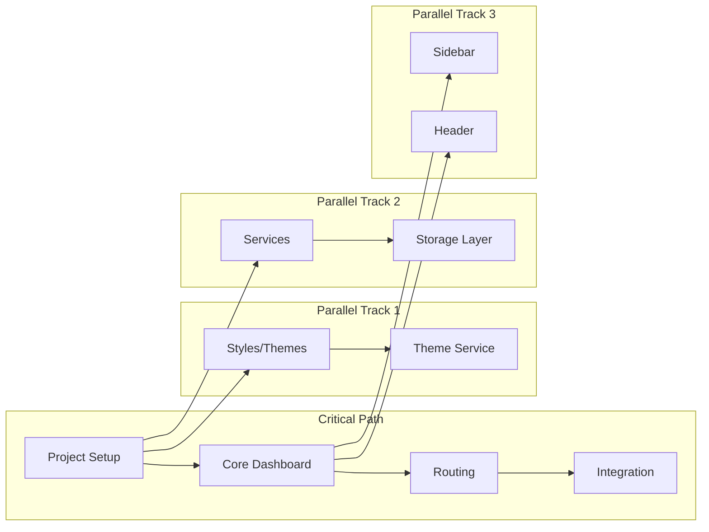

# Dashboard Implementation Execution Orchestration

## 🎭 Orchestration Overview

This document provides the execution orchestration strategy for implementing the dashboard with maximum parallelization and efficiency.

## Dependency Resolution Matrix



## 🚀 Execution Orchestration Engine

### Automated Orchestration Script
```javascript
// orchestrator.js - Intelligent task execution manager
class DashboardOrchestrator {
  constructor() {
    this.tasks = new Map();
    this.completed = new Set();
    this.running = new Set();
    this.maxParallel = 3;
  }
  
  // Define all tasks with dependencies
  initializeTasks() {
    // Phase 1 Tasks
    this.addTask('setup', [], () => this.setupEnvironment());
    this.addTask('styles', ['setup'], () => this.createStyles());
    this.addTask('services', ['setup'], () => this.createServices());
    this.addTask('dashboard', ['setup'], () => this.createDashboard());
    this.addTask('sidebar', ['dashboard'], () => this.createSidebar());
    this.addTask('theme-service', ['styles', 'services'], () => this.createThemeService());
    this.addTask('router', ['dashboard'], () => this.setupRouter());
    this.addTask('todos-view', ['router'], () => this.createTodosView());
    
    // Phase 2 Tasks
    this.addTask('header', ['dashboard'], () => this.createHeader());
    this.addTask('user-menu', ['header'], () => this.createUserMenu());
    this.addTask('search', ['header'], () => this.createSearchBar());
    this.addTask('notifications', ['header'], () => this.createNotifications());
    this.addTask('settings-view', ['router'], () => this.createSettingsView());
    this.addTask('profile-view', ['router', 'user-menu'], () => this.createProfileView());
    
    // Phase 3 Tasks
    this.addTask('analytics-view', ['router'], () => this.createAnalyticsView());
    this.addTask('widgets', ['analytics-view'], () => this.createWidgets());
    this.addTask('custom-themes', ['theme-service', 'settings-view'], () => this.createCustomThemes());
    this.addTask('keyboard', ['dashboard'], () => this.setupKeyboardShortcuts());
    this.addTask('pwa', ['dashboard'], () => this.setupPWA());
    
    // Phase 4 Tasks
    this.addTask('optimization', ['all-features'], () => this.optimizePerformance());
    this.addTask('accessibility', ['all-features'], () => this.auditAccessibility());
    this.addTask('testing', ['all-features'], () => this.runTests());
    this.addTask('documentation', ['testing'], () => this.generateDocs());
  }
  
  addTask(id, dependencies, executor) {
    this.tasks.set(id, { id, dependencies, executor, status: 'pending' });
  }
  
  async execute() {
    console.log('🚀 Starting Dashboard Implementation Orchestration');
    
    while (this.completed.size < this.tasks.size) {
      const availableTasks = this.getAvailableTasks();
      
      if (availableTasks.length === 0 && this.running.size === 0) {
        throw new Error('Deadlock detected! Check dependencies.');
      }
      
      // Execute available tasks in parallel (up to limit)
      const tasksToRun = availableTasks.slice(0, this.maxParallel - this.running.size);
      
      await Promise.all(tasksToRun.map(task => this.runTask(task)));
      
      // Wait a bit before checking again
      await new Promise(resolve => setTimeout(resolve, 100));
    }
    
    console.log('✅ All tasks completed successfully!');
  }
  
  getAvailableTasks() {
    return Array.from(this.tasks.values()).filter(task => {
      if (this.completed.has(task.id) || this.running.has(task.id)) {
        return false;
      }
      
      return task.dependencies.every(dep => this.completed.has(dep));
    });
  }
  
  async runTask(task) {
    console.log(`⚡ Starting: ${task.id}`);
    this.running.add(task.id);
    task.status = 'running';
    
    try {
      await task.executor();
      this.completed.add(task.id);
      this.running.delete(task.id);
      task.status = 'completed';
      console.log(`✅ Completed: ${task.id}`);
    } catch (error) {
      task.status = 'failed';
      console.error(`❌ Failed: ${task.id}`, error);
      throw error;
    }
  }
  
  // Task Implementations
  async setupEnvironment() {
    // Implementation for environment setup
    await this.exec('npm install lit @lit/context @vaadin/router');
    await this.exec('mkdir -p src/dashboard/{components,views,services,styles,utils}');
  }
  
  async createStyles() {
    // Create all style files
    await Promise.all([
      this.writeFile('src/dashboard/styles/themes/light-theme.js', lightThemeContent),
      this.writeFile('src/dashboard/styles/themes/dark-theme.js', darkThemeContent),
      this.writeFile('src/dashboard/styles/shared-styles.js', sharedStylesContent),
      this.writeFile('src/dashboard/styles/responsive.js', responsiveContent)
    ]);
  }
  
  // ... Additional task implementations
  
  // Utility methods
  async exec(command) {
    const { exec } = require('child_process');
    return new Promise((resolve, reject) => {
      exec(command, (error, stdout, stderr) => {
        if (error) reject(error);
        else resolve(stdout);
      });
    });
  }
  
  async writeFile(path, content) {
    const fs = require('fs').promises;
    await fs.writeFile(path, content);
  }
}

// Execute orchestration
const orchestrator = new DashboardOrchestrator();
orchestrator.initializeTasks();
orchestrator.execute();
```

## 📊 Parallel Execution Strategies

### Strategy 1: Maximum Parallelization (3 Developers)
```yaml
timeline:
  day_1:
    developer_1: [setup, dashboard, router]
    developer_2: [setup, styles, theme-service]
    developer_3: [setup, services, storage]
    
  day_2:
    developer_1: [sidebar, todos-view]
    developer_2: [header, user-menu]
    developer_3: [search, notifications]
    
  day_3:
    developer_1: [settings-view, profile-view]
    developer_2: [analytics-view, widgets]
    developer_3: [custom-themes, keyboard]
    
  day_4:
    developer_1: [pwa, optimization]
    developer_2: [accessibility, testing]
    developer_3: [documentation, deployment]

efficiency: 80% parallelization
completion: 4 days
```

### Strategy 2: Balanced Approach (2 Developers)
```yaml
timeline:
  week_1:
    developer_1: [core-dashboard, routing, todos]
    developer_2: [styles, themes, services]
    
  week_2:
    developer_1: [user-features, search, notifications]
    developer_2: [views, analytics, widgets]
    
  week_3:
    developer_1: [advanced-features, pwa]
    developer_2: [testing, optimization]

efficiency: 60% parallelization
completion: 3 weeks
```

### Strategy 3: Solo Developer Optimized
```yaml
timeline:
  week_1:
    morning: [setup, styles, services]
    afternoon: [dashboard, sidebar, router]
    
  week_2:
    morning: [header, user-features]
    afternoon: [views, integration]
    
  week_3:
    morning: [advanced-features]
    afternoon: [testing, optimization]
    
  week_4:
    morning: [accessibility, documentation]
    afternoon: [deployment, review]

efficiency: 30% parallelization
completion: 4 weeks
```

## 🔄 Continuous Integration Pipeline

### GitHub Actions Workflow
```yaml
# .github/workflows/dashboard-ci.yml
name: Dashboard CI/CD Pipeline

on:
  push:
    branches: [feature/dashboard]
  pull_request:
    branches: [main]

jobs:
  parallel-validation:
    runs-on: ubuntu-latest
    strategy:
      matrix:
        task: [lint, test, build, accessibility]
    
    steps:
      - uses: actions/checkout@v3
      
      - name: Setup Node
        uses: actions/setup-node@v3
        with:
          node-version: '18'
          cache: 'npm'
      
      - name: Install Dependencies
        run: npm ci
      
      - name: Run ${{ matrix.task }}
        run: npm run ${{ matrix.task }}
  
  integration:
    needs: parallel-validation
    runs-on: ubuntu-latest
    
    steps:
      - uses: actions/checkout@v3
      
      - name: E2E Tests
        run: |
          npm ci
          npx playwright install
          npm run test:e2e
      
      - name: Performance Audit
        run: |
          npm run build
          npx lighthouse-ci
      
      - name: Bundle Analysis
        run: |
          npm run analyze
          
  deploy:
    needs: integration
    if: github.ref == 'refs/heads/main'
    runs-on: ubuntu-latest
    
    steps:
      - name: Deploy to Production
        run: npm run deploy
```

## 🎯 Task Prioritization Algorithm

```javascript
class TaskPrioritizer {
  constructor(tasks) {
    this.tasks = tasks;
    this.priorities = new Map();
  }
  
  calculatePriorities() {
    this.tasks.forEach(task => {
      const priority = this.calculateTaskPriority(task);
      this.priorities.set(task.id, priority);
    });
    
    return Array.from(this.priorities.entries())
      .sort((a, b) => b[1] - a[1])
      .map(([id]) => id);
  }
  
  calculateTaskPriority(task) {
    let priority = 0;
    
    // Critical path tasks get highest priority
    if (this.isOnCriticalPath(task)) priority += 100;
    
    // Tasks with many dependents get higher priority
    priority += this.getDependentCount(task) * 10;
    
    // Tasks that can be parallelized get bonus
    if (this.canBeParallelized(task)) priority += 20;
    
    // User-facing features get priority
    if (this.isUserFacing(task)) priority += 30;
    
    // Performance/security tasks get priority
    if (this.isQualityTask(task)) priority += 25;
    
    return priority;
  }
  
  isOnCriticalPath(task) {
    const criticalPath = ['setup', 'dashboard', 'router', 'integration'];
    return criticalPath.includes(task.id);
  }
  
  getDependentCount(task) {
    return this.tasks.filter(t => t.dependencies.includes(task.id)).length;
  }
  
  canBeParallelized(task) {
    return task.dependencies.length === 0 || 
           task.dependencies.every(dep => this.isCompleted(dep));
  }
  
  isUserFacing(task) {
    const userFacing = ['header', 'sidebar', 'search', 'notifications', 'user-menu'];
    return userFacing.includes(task.id);
  }
  
  isQualityTask(task) {
    const qualityTasks = ['optimization', 'accessibility', 'testing', 'security'];
    return qualityTasks.includes(task.id);
  }
}
```

## 📈 Progress Monitoring Dashboard

```javascript
// progress-monitor.js
class ProgressMonitor {
  constructor() {
    this.startTime = Date.now();
    this.tasks = new Map();
    this.phases = {
      phase1: { total: 8, completed: 0 },
      phase2: { total: 6, completed: 0 },
      phase3: { total: 5, completed: 0 },
      phase4: { total: 4, completed: 0 }
    };
  }
  
  startTask(taskId, phase) {
    this.tasks.set(taskId, {
      phase,
      startTime: Date.now(),
      status: 'running'
    });
    
    this.updateDashboard();
  }
  
  completeTask(taskId) {
    const task = this.tasks.get(taskId);
    task.endTime = Date.now();
    task.duration = task.endTime - task.startTime;
    task.status = 'completed';
    
    this.phases[task.phase].completed++;
    this.updateDashboard();
  }
  
  updateDashboard() {
    console.clear();
    console.log('📊 DASHBOARD IMPLEMENTATION PROGRESS\n');
    console.log('═══════════════════════════════════════\n');
    
    // Overall progress
    const totalTasks = Object.values(this.phases).reduce((sum, p) => sum + p.total, 0);
    const completedTasks = Object.values(this.phases).reduce((sum, p) => sum + p.completed, 0);
    const overallProgress = (completedTasks / totalTasks * 100).toFixed(1);
    
    console.log(`Overall Progress: ${this.progressBar(overallProgress)} ${overallProgress}%`);
    console.log(`Tasks: ${completedTasks}/${totalTasks}\n`);
    
    // Phase progress
    Object.entries(this.phases).forEach(([phase, data]) => {
      const progress = (data.completed / data.total * 100).toFixed(1);
      console.log(`${phase}: ${this.progressBar(progress)} ${progress}%`);
    });
    
    // Running tasks
    const running = Array.from(this.tasks.values())
      .filter(t => t.status === 'running')
      .map(t => t.id);
    
    if (running.length > 0) {
      console.log(`\n⚡ Running: ${running.join(', ')}`);
    }
    
    // Time tracking
    const elapsed = Date.now() - this.startTime;
    const timeStr = this.formatTime(elapsed);
    console.log(`\n⏱️  Elapsed: ${timeStr}`);
    
    // Estimated completion
    if (completedTasks > 0) {
      const avgTaskTime = elapsed / completedTasks;
      const remainingTime = avgTaskTime * (totalTasks - completedTasks);
      console.log(`📅 Estimated Completion: ${this.formatTime(remainingTime)}`);
    }
  }
  
  progressBar(percentage) {
    const filled = Math.floor(percentage / 5);
    const empty = 20 - filled;
    return '█'.repeat(filled) + '░'.repeat(empty);
  }
  
  formatTime(ms) {
    const hours = Math.floor(ms / 3600000);
    const minutes = Math.floor((ms % 3600000) / 60000);
    return `${hours}h ${minutes}m`;
  }
}
```

## 🔧 Resource Optimization

### Parallel Resource Allocation
```javascript
class ResourceAllocator {
  constructor() {
    this.resources = {
      cpu: { available: 100, allocated: 0 },
      memory: { available: 16384, allocated: 0 }, // MB
      network: { available: 1000, allocated: 0 }, // Mbps
      developers: { available: 3, allocated: 0 }
    };
  }
  
  allocateForTask(task) {
    const requirements = this.getTaskRequirements(task);
    
    if (this.canAllocate(requirements)) {
      Object.entries(requirements).forEach(([resource, amount]) => {
        this.resources[resource].allocated += amount;
      });
      
      return true;
    }
    
    return false;
  }
  
  getTaskRequirements(task) {
    const requirements = {
      setup: { cpu: 20, memory: 2048, network: 100, developers: 1 },
      dashboard: { cpu: 30, memory: 1024, network: 50, developers: 1 },
      styles: { cpu: 10, memory: 512, network: 10, developers: 0.5 },
      services: { cpu: 20, memory: 1024, network: 20, developers: 0.5 },
      testing: { cpu: 40, memory: 4096, network: 100, developers: 1 },
      build: { cpu: 50, memory: 2048, network: 50, developers: 0 }
    };
    
    return requirements[task.type] || { cpu: 10, memory: 512, network: 10, developers: 0.5 };
  }
  
  canAllocate(requirements) {
    return Object.entries(requirements).every(([resource, amount]) => {
      return this.resources[resource].available - this.resources[resource].allocated >= amount;
    });
  }
  
  releaseResources(task) {
    const requirements = this.getTaskRequirements(task);
    
    Object.entries(requirements).forEach(([resource, amount]) => {
      this.resources[resource].allocated -= amount;
    });
  }
  
  getUtilization() {
    const utilization = {};
    
    Object.entries(this.resources).forEach(([resource, data]) => {
      utilization[resource] = (data.allocated / data.available * 100).toFixed(1) + '%';
    });
    
    return utilization;
  }
}
```

## 🎉 Completion Verification

### Final Validation Checklist
```bash
#!/bin/bash

echo "🔍 Final Dashboard Implementation Validation"
echo "==========================================="

# Phase 1 Verification
echo "📋 Phase 1: Core Dashboard"
[ -f "src/dashboard/app-dashboard.js" ] && echo "✅ Dashboard container" || echo "❌ Dashboard container"
[ -f "src/dashboard/components/app-sidebar.js" ] && echo "✅ Sidebar" || echo "❌ Sidebar"
[ -f "src/dashboard/services/theme-service.js" ] && echo "✅ Theme service" || echo "❌ Theme service"
[ -f "src/dashboard/services/router-service.js" ] && echo "✅ Router" || echo "❌ Router"
[ -f "src/dashboard/views/todos-view.js" ] && echo "✅ Todos view" || echo "❌ Todos view"

# Phase 2 Verification
echo "\n📋 Phase 2: User Features"
[ -f "src/dashboard/components/app-header.js" ] && echo "✅ Header" || echo "❌ Header"
[ -f "src/dashboard/components/app-user-menu.js" ] && echo "✅ User menu" || echo "❌ User menu"
[ -f "src/dashboard/components/app-search-bar.js" ] && echo "✅ Search bar" || echo "❌ Search bar"
[ -f "src/dashboard/components/app-notifications.js" ] && echo "✅ Notifications" || echo "❌ Notifications"

# Phase 3 Verification
echo "\n📋 Phase 3: Advanced Features"
[ -f "src/dashboard/views/analytics-view.js" ] && echo "✅ Analytics" || echo "❌ Analytics"
[ -f "src/dashboard/views/widgets-view.js" ] && echo "✅ Widgets" || echo "❌ Widgets"

# Phase 4 Verification
echo "\n📋 Phase 4: Quality & Polish"
npm run test > /dev/null 2>&1 && echo "✅ Tests passing" || echo "❌ Tests failing"
npm run lint > /dev/null 2>&1 && echo "✅ Linting clean" || echo "❌ Linting errors"
npm run build > /dev/null 2>&1 && echo "✅ Build successful" || echo "❌ Build failed"

echo "\n🎊 Validation Complete!"
```

---

*This orchestration document provides the execution framework for efficient parallel implementation of the dashboard.*